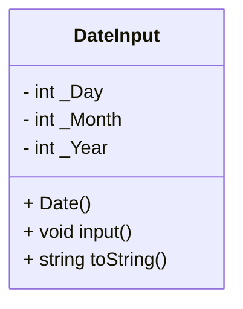

## Class diagram for `DateInput'

```mermaid 
classDiagram
    class DateInput{
        - int _Day
        - int _Month
        - int _Year

        + Date()
        + void input()
        + string toString()
    }

```
