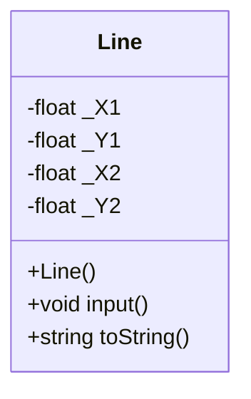

## Class Diagram for  `Lineinput`

```mermaid
classDiagram
    class Line{
        -float _X1
        -float _Y1
        -float _X2
        -float _Y2
        +Line()
        +void input()
        +string toString()
    }
```