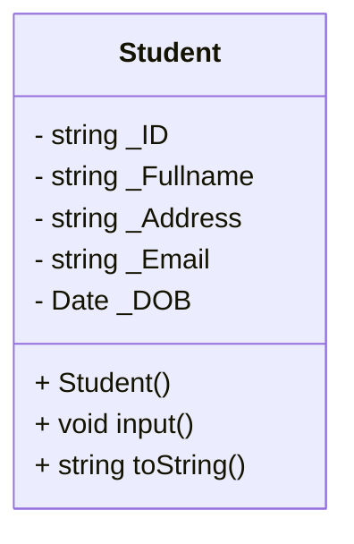

```mermaid 
classDiagram
    class Student {
        - string _ID
        - string _Fullname
        - string _Address
        - string _Email
        - Date _DOB
        + Student()
        + void input()
        + string toString()
    }
```